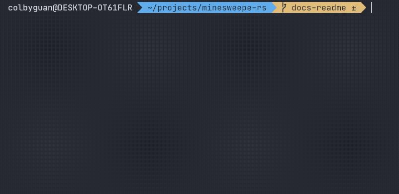

# minesweeper-rust-example
Documenting my journey of getting slapped around by the Rust compiler. 
I'm also still getting the hang of terminal raw mode.

Tested on Windows subsystem for Linux - Ubuntu

## Demo
